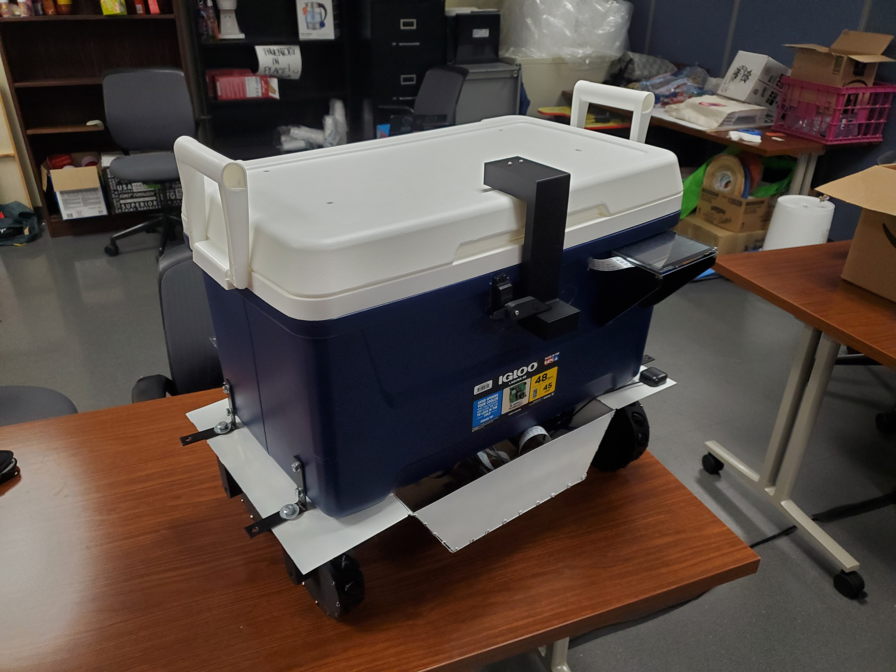

  
  

# [Vending Machine Robot](https://github.com/orgs/Vendning-Machine-Team/repositories) - Engineering Team
### By Ryler Collins, Victoria Adams, Anthony Nguyen, and Matthew Beck

**Please consider:** if you like it, **star it!**

## Schedule
- **Timeframe:** January 19th, 2026, to April 19th, 2026 *(3 months)*
- **Work Hours:** 138.25 man-hours *(around 34 hours per member)*

## Tools
- **Software:** Solidworks, Fusion
- **Manufacturing:** Welding *(MIG)*, 3D Printing, Soldering
- **Hardware:** M3 and M8 Bolts *(used to supplement the strength of PLA with metal)*

## Materials
- **24-Gauge Mild Steel:** Chosen as the chassis material for its strength under flexural load and speed of fabrication
- **3D-Printed PLA:** Chosen for its low cost and ease of fabrication
- **3D-Printed TPU:** Chosen as the mecanum wheel roller material for its elastic damping properties, low cost, and ease of fabrication

## Roles

  

**Ryler Collins ([LinkedIn](https://www.linkedin.com/in/ryler-collins-87230a336/)):**
- Chief Design Authority *(oversaw the design and sign-off of parts and taught new engineers solidworks and good design principles)*
- Mechanical Engineer *(designed chassis)*
- Chief Robot Assembler *(assembled primary robot body and wheel assemblies)*

  

**Anthony Nguyen ([LinkedIn](https://www.linkedin.com/in/anthony-nguyen-962b7935b/) | [GitHub](https://github.com/anthonynguyen794-commits)):**
- Mechanical Engineer *(designed wheel mounts and electronic mounts)*
- Robot Assembler *(assembled mecanum wheels)*

  

**Victoria Adams ([LinkedIn](https://www.linkedin.com/in/victoria-adams-9b43b93ba/) | [GitHub](https://github.com/Victoria-A29)):**
- Mechanical Engineer *(designed wheels and lid-lifting assembly)*
- Electrical System Assembler *(soldered and assembled electrical system)*

  

**Matthew Beck ([LinkedIn](https://www.linkedin.com/in/matthewthomasbeck/) | [GitHub](https://github.com/matthewthomasbeck) | [Website](https://www.matthewthomasbeck.com)):**
- Parts Manufacterer *(cut/welded chassis and oversaw operation and repair of 3D printer)*
- Electrical System Designer *(designed electrical system and taught others basic electrical safety, diagraming, wiring, and soldering)*

## Engineering Challenges

- **Structural Limitations of PLA:** While 3D printing enabled low-cost and rapid manufacturing, PLA has relatively low strength, and some components experienced shearing or deformation under load. To address this, higher infill percentages were used for high-stress components, and stress concentrations were reduced by incorporating rounded geometries and fillets into the design.

- **Cardboard Robot:** In order to get a working system to the [AI / Robotic Behavior](https://github.com/Vendning-Machine-Team/Vending_Machine_Robot-Hardware) team with as much time as possible, we had to come up with a speedy solution that would be representative of our actual robot; we devised a carboard robot that structurally was very similar to our desired end-product.

  
  

- **Designing The Electrical System:** The electrical system brought several challenges: different devices requiring different voltages, heating concerns, and evolutionary-capability. Some electrical parts were behind shipment schedule, so we had to ensure the system could run for the [AI / Robotic Behavior](https://github.com/Vendning-Machine-Team/Vending_Machine_Robot-Hardware) team, while also being able to accomodate parts down the line.

  
  

- **Manufacturing Limitations:** One challenge encountered was managing manufacturing limitations due to 3D printing. The time required to produce parts slowed down iteration cycles, requiring careful planning of design changes. To address this, components were prioritized and optimized to reduce print time while maintaining functionality.

- **3D Printer Problems:** Over the course of printing, the 3D-printer broke twice: the extruder badly jammed and the plate was out of calibration, both problems involving the disassembly of the machine to fix it at late hours to ensure the project remained on-schedule. Beyond that, there were classical 3D printing problems such as adjusting infill percentages, print speeds, extruder/plate temperatures, brims, rafts, and print orientations.

  
  

- **Welding Thin-Gauge Steel:** Welding such a thin gauge of steel meant that each weld had to be done with the precise voltage, feed rate, and weld-times; any discrepancy would mean catastrophic burn-throughs.

  
  

