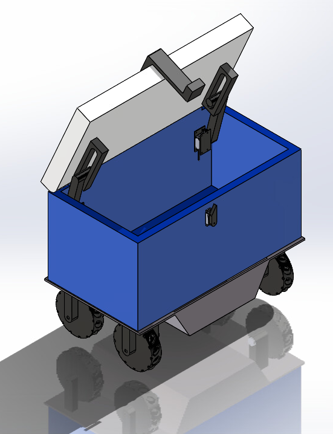

# Vending Machine Robot - Mechanical Parts
### By [Ryler Collins](https://www.linkedin.com/in/ryler-collins-87230a336/), [Victoria Adams](https://www.linkedin.com/in/victoria-adams-9b43b93ba/), [Anthony Nguyen](https://www.linkedin.com/in/anthony-nguyen-962b7935b/), and [Matthew Beck](https://www.linkedin.com/in/matthewthomasbeck/)

**Please consider:** if you like it, **star it!**

## Design Requirements / Specifications
- **Timeframe:** January 19th, 2026, to April 19th, 2026 *(3 months)*
- **Work Hours:** 138.25 man-hours *(around 34 hours per member)*
- **Total Mass:** *TBD*
- **Target Payload:** *TBD*

## Tools
- **Software:** Solidworks, Fusion
- **Manufacturing:** Welding *(MIG)*, 3D Printing, Soldering

## Materials
- **24-Gauge Mild Steel:** Chosen as the chassis material for its strength under flexural load and speed of fabrication
- **3D-Printed PLA:** Chosen for its low cost and ease of fabrication
- **3D-Printed TPU:** Chosen as the mecanum wheel roller material for its elastic damping properties, low cost, and ease of fabrication

## Roles
**Ryler Collins:**
- Chief Design Authority *(oversaw the design and sign-off of parts and taught new engineers solidworks and good design principles)*
- Mechanical Engineer *(designed chassis)*
- Chief Robot Assembler *(assembled primary robot body and wheel assemblies)*

**Anthony Nguyen:**
- Mechanical Engineer *(designed wheel mounts and electronic mounts)*
- Robot Assembler *(assembled mecanum wheels)*

**Victoria Adams:**
- Mechanical Engineer *(designed wheels and lid-lifting assembly)*
- Electrical System Assembler *(soldered and assembled electrical system)*

**Matthew Beck:**
- Parts Manufacterer *(cut/welded chassis and oversaw operation and repair of 3D printer)*
- Electrical System Designer *(designed electrical system and taught others basic electrical safety, diagraming, wiring, and soldering)*

## Engineering Challenges
- **TODO:** Add more challenges that have more to do with design and less to do with fabrication

- **3D Printer Problems:** Over the course of printing, the 3D-printer broke twice: the extruder badly jammed and the plate was out of calibration, both problems involving the disassembly of the machine to fix it at late hours to ensure the project remained on-schedule. Beyond that, there were classical 3D printing problems such as adjusting infill percentages, print speeds, extruder/plate temperatures, brims, rafts, and print orientations.

- **Welding Thin-Gauge Steel:** Welding such a thin-gauge of steel meant that each weld had to be done with the precise voltage, feed rate, and weld-times; any discrepancy would mean catastrophic burn-throughs.
